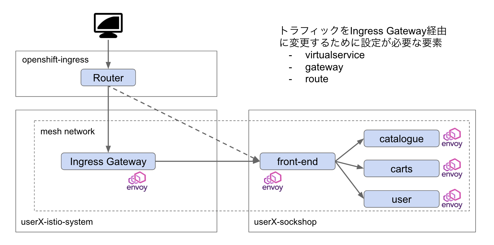
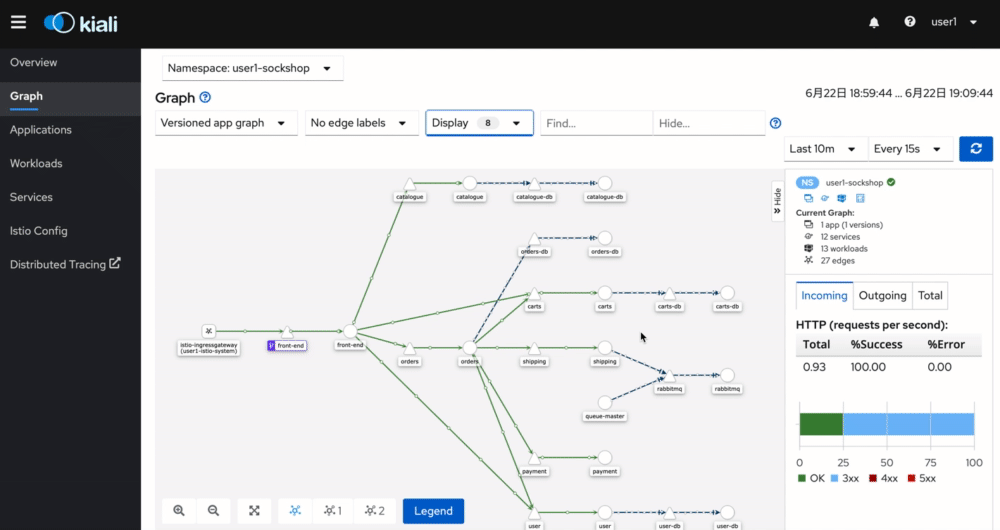
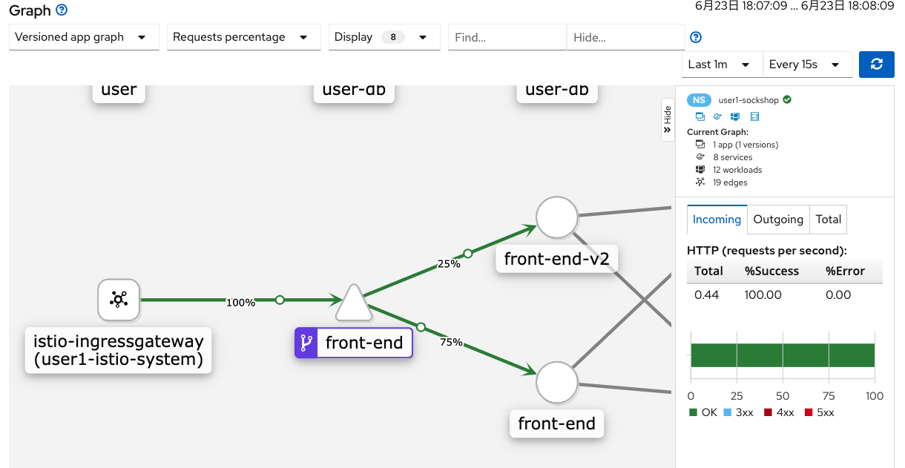

# SockShopへのService Meshの導入

## 事前準備（管理者向け）
Service Meshのコントロールプレーンをインストールするには、いくつかのOperatorの事前のインストールが必要です。
下記のOperatorのインストールを済ませておきましょう。

- Jaeger operator
- ElasticSearch operator
- ServiceMesh operator
- Kiali operator

## Service Meshのインストール
Service Mesh本体（コントロールプレーン）をインストールします。  
Service Meshのコントロールプレーン自体もOperatorを使ってインストールすることが可能です。
kialiのPodまで立ち上がっていれば、インストールは成功です。

```
$ oc new-project $OCP_USER-istio-system
$ cd service-mesh
$ cat istio-control-plane.yaml
apiVersion: maistra.io/v1
kind: ServiceMeshControlPlane
metadata:
  name: basic-install
spec:
  istio:
    global:
      disablePolicyChecks: false
      mtls:
        enabled: false
...

$ oc apply -f istio-control-plane.yaml -n $OCP_USER-istio-system
$ oc get pod -n $OCP_USER-istio-system
NAME                                      READY   STATUS    RESTARTS   AGE
grafana-7df65c57d5-8tzqn                  2/2     Running   12         5d19h
istio-citadel-54fc4655b4-hb28n            1/1     Running   6          5d19h
istio-egressgateway-6bb97d479d-smwck      1/1     Running   2          29h
istio-galley-797746b78d-b5vxv             1/1     Running   6          5d19h
istio-ingressgateway-66fcccb49d-c4s9d     1/1     Running   0          140m
istio-pilot-567c947974-xjp8l              2/2     Running   4          29h
istio-policy-5fcfd5f79c-7rk44             2/2     Running   5          29h
istio-sidecar-injector-75577f4fdb-gz9vk   1/1     Running   6          5d19h
istio-telemetry-dbc897cbb-v7sv9           2/2     Running   5          29h
jaeger-778bcb6bf4-t8n6t                   2/2     Running   12         5d19h
kiali-78b6f44646-pqzq8                    1/1     Running   1          17h
prometheus-884ff6bf9-5mbh7                2/2     Running   12         5d19h
```

## SockShopへの適応
### SockShopをmember rollに追加
インストールしたコントロールプレーンが対象とする範囲を決めます。
`ServiceMeshMemberRoll`と呼ばれるカスタムリソースで設定できます。
今回はひとつのsockshopアプリケーションのProjectのみとなります。  
`configureMembers`に`userX-sockshop`が含まれていればメンバー追加ができています。

```
$ oc apply -f servicemesh/member-roll.yaml -n $OCP_USER-istio-system
servicemeshmemberroll.maistra.io/default created

$ oc get ServiceMeshMemberRoll default -o yaml | grep -A 1 configuredMembers
  configuredMembers:
  - userX-sockshop
```

この時点で、今まで通りRoute経由でSockShopへはアクセスできなくなります（確認してみましょう）。  
理由は、NetworkPolicyの設定でRouterから直接の通信は遮断されているからです。IstioのIngress Gatewayを利用してアクセスするように設定変更をする必要があります。

```
$ oc get networkpolicy -n $OCP_USER-sockshop
NAME                 POD-SELECTOR                   AGE
istio-expose-route   maistra.io/expose-route=true   70s
istio-mesh           <none>                         70s

$ oc get networkpolicy -n $OCP_USER-sockshop istio-mesh -o yaml
...
spec:
  ingress:
  - from:
    - namespaceSelector:
        matchLabels:
          maistra.io/member-of: user1-istio-system
...
```

この時点でアクセスしたい場合は、ポートフォワードを活用すると良いです。

```
$ oc port-forward service/front-end 8080:80
Forwarding from 127.0.0.1:8080 -> 8079
Forwarding from [::1]:8080 -> 8079
```

### 各サービスへEnvoy Proxyを導入
Service Meshの要である、Envoy Proxyを各アプリケーションに配置していきます。
deploymentのannotationsに `"sidecar.istio.io/inject": "true"` を入れることで、[Admission Controller](https://kubernetes.io/docs/reference/access-authn-authz/admission-controllers/)がPodに対して、自動的にサイドカーコンテナとしてEnvoy Proxyを注入します。 
すべてのデプロイメントに対して、annotationsをpatchしていきます。  
※本環境では、永続ボリュームを利用していないため、Podが再デプロイされたタイミングで以前に保存したデータが削除される点ご注意ください。

```
$ for deployment_name in $(oc get deploy | sed '1d' | awk '{print $1}')
do
    oc patch deploy $deployment_name --type='json' -p "[{\"op\": \"add\", \"path\": \"/spec/template/metadata\", \"value\": {\"annotations\":{\"sidecar.istio.io/inject\": \"true\"}, \"labels\":{\"name\":\"$deployment_name\"}}}]"
done

deployment.extensions/carts patched
deployment.extensions/carts-db patched
deployment.extensions/catalogue patched
deployment.extensions/catalogue-db patched
deployment.extensions/front-end patched
deployment.extensions/orders patched
deployment.extensions/orders-db patched
deployment.extensions/payment patched
deployment.extensions/queue-master patched
deployment.extensions/rabbitmq patched
deployment.extensions/shipping patched
deployment.extensions/user patched
deployment.extensions/user-db patched
```

ぜひPodの状態を確認してみましょう。  
Pod内のコンテナ数が`2/2`と変化していることが確認できるはずです。

```
$ oc get pod -w
NAME                            READY   STATUS    RESTARTS   AGE
carts-775b5b784b-cmfn7          2/2     Running   0          6h3m
carts-db-7976bd95d4-zshrt       2/2     Running   0          6h3m
catalogue-7bbd76d66-sszxj       2/2     Running   0          5h30m
catalogue-db-74594d89f8-n8fd7   2/2     Running   0          33s
front-end-665658854d-n5vc8      2/2     Running   0          6h3m
orders-74dd49b86c-d2mvr         2/2     Running   0          6h3m
orders-db-58554f4464-jmbqg      2/2     Running   0          6h3m
payment-56cb9cd8fb-n47jj        2/2     Running   0          6h3m
queue-master-55ddb495d7-bm2pm   2/2     Running   0          6h3m
rabbitmq-9cb6c88f5-8d44b        2/2     Running   1          6h3m
shipping-7d68cc8c75-hmk82       2/2     Running   0          6h3m
user-759b999dd9-g7bc7           2/2     Running   0          6h3m
user-db-678f7786ff-g5dl7        2/2     Running   0          28s
```

### Ingressトラフィックの切り替え
Service Meshのハンズオン以前では、Routeが直接にfront-endサービスにアクセスすることでアプリケーションを公開していました。
上で見たように、現在はNetworkPolicyによってistioのコントロールプレーンからアクセスできるようになっており、ネットワーク経路を変更する必要があります。  
これらの変更を行うために、[VirtualService](https://archive.istio.io/v1.4/docs/reference/config/networking/virtual-service/)、[Gateway](https://archive.istio.io/v1.4/docs/reference/config/networking/gateway/)、Routeの設定をしていきます。(VirtualService, GatewayはIstioのカスタムリソースです。)

- VirtualService
  - トラフィックのルーティングルールに関する設定で、istio内のingressと理解するとわかりやすい。ホスト名、Gateway、バックエンドのサービスなどを設定する。istioコントロールプレーンのingress-gatewayから入ってきたトラフォックをコントロールするために存在する。
- Gateway
  - ロードバランシングに関する設定。待ち受けるポートやドメイン名などを指定する。Gatewayで受け付けたトラフィックをVirtualServiceのルールに基づいてルーティングすると考えるとわかりやすい。



```
// spec.hostsとspec.http.route.destination.host内の値を適切なもの変更
$ vim virtualservice.yaml
  hosts:
    - front-end-user1-sockshop.apps.cluster-6a92.6a92.sandbox595.opentlc.com
  ...
    - destination:
        port:
          number: 80
        host: front-end.user1-sockshop.svc.cluster.local

$ oc apply -f virtualservice.yaml -n $OCP_USER-sockshop
virtualservice.networking.istio.io/front-end-virtualservice created

$ oc get virtualservice -n $OCP_USER-sockshop
oc get virtualservice
NAME                       GATEWAYS                      HOSTS                                       AGE
front-end-virtualservice   [sockshop-wildcard-gateway]   [front-end-user1-sockshop.apps.xxxxx.com]   28s
```

```
$ vim gateway.yaml
...
    hosts:
    - "*.apps.cluster-6a92.6a92.sandbox595.opentlc.com"

$ oc apply -f gateway.yaml -n $OCP_USER-sockshop
gateway.networking.istio.io/sockshop-wildcard-gateway created

$ oc get gateway -n $OCP_USER-sockshop
NAME                        AGE
sockshop-wildcard-gateway   40s
```

```
$ oc delete route front-end -n $OCP_USER-sockshop
$ vim route.yaml
spec:
  host: front-end-user1-sockshop.apps.cluster-6a92.6a92.sandbox595.opentlc.com

$ oc apply -f route.yaml -n $OCP_USER-istio-system
$ oc get route front-end-service-gateway -n $OCP_USER-istio-system
NAME                        HOST/PORT                                                                PATH   SERVICES               PORT   TERMINATION   WILDCARD
front-end-service-gateway   front-end-user1-sockshop.apps.cluster-6a92.6a92.sandbox595.opentlc.com          istio-ingressgateway   8080                 None
```

新しく作成した`front-end-service-gateway`のRouteのホストに対してアクセスし無事にSockShopアプリケーションの画面が出てくれば設定は成功です。  
`Route -> ingress-gateway -> front-end service` でアクセスがされています。

この時点で一度Kialiにログインをし、Envoy Proxyを導入したことによる恩恵を確認してみよう。
Ingress Gatewayからのトラフィックを可視化できていることを確認できます。



## レジリエンス
cartsサービスのタイムアウトを待っていたのをなくしたい

## トラフィック制御
複数バージョンある、front-endのサービスのトラフィック比率の変更を行ってみます。  

front-endを複数バージョンリリースします。
複数バージョンをリリースしたのち、ブラウザからアプリケーションにアクセスしてみましょう。おそらく、ランダム（50％程度の確立）で、新旧のバージョンが表示されるのではないかと思います。

```
$ oc apply -f front-end-v2.yaml -n $OCP_USER-sockshop
$ oc get pod -n $OCP_USER-sockshop
```

この状態に、トラフィック比率のコントロールを設定します。  
`DestinationRule` に `Subsets` 分散先を登録します。
`VirtualService` にその重みやルールを設定していきます。  
このハンズオンでは、Session Affinityの機能を利用しませんが、利用することで特定のセッションを継続して特定のバージョンのサービスに振ることも可能で、A/Bテストなどに利用しやすくなります。

```
$ oc apply -f front-end-destinationrule.yaml
$ oc apply -f virtualservice-v2.yaml

$ watch curl xxxxxxxxx.com
```

kialiでトラフィックの分散の様子を確認してみましょう。  
トラフィックの比率を表示するとおおよそ80:20で流れていることを確認できるはずです。



## トレーシング
特に何も設定することなしに分散トレーシングが実現

## トラフィックモニタリング

